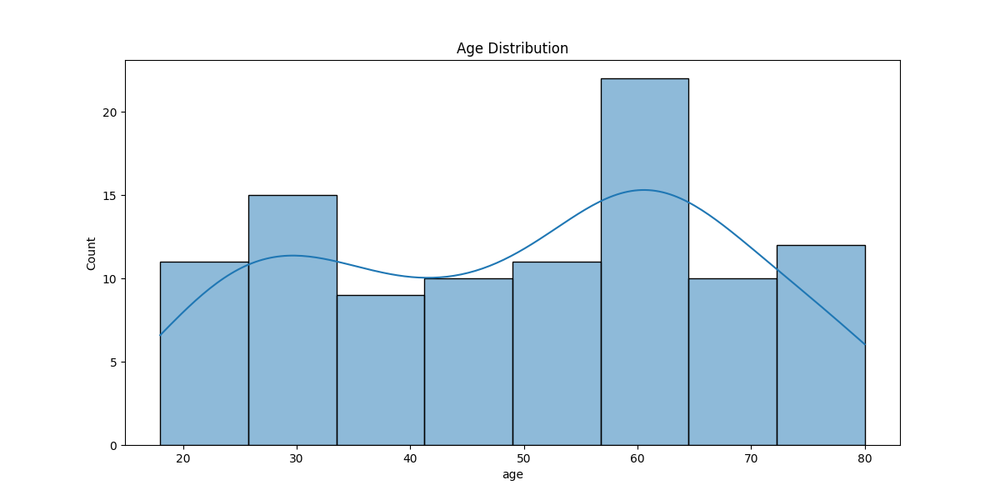
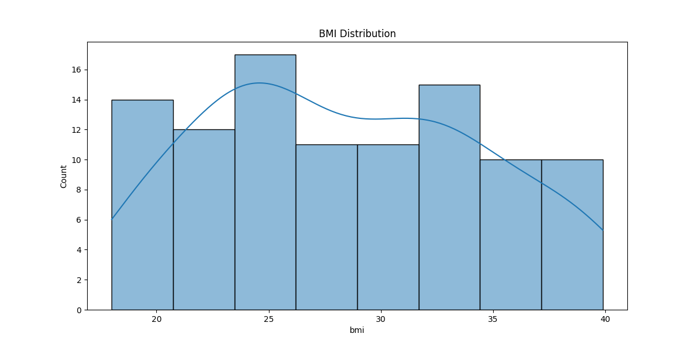
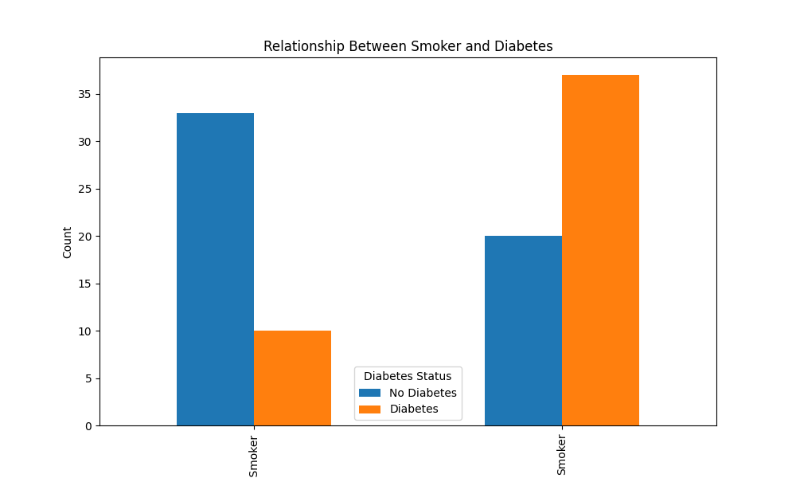
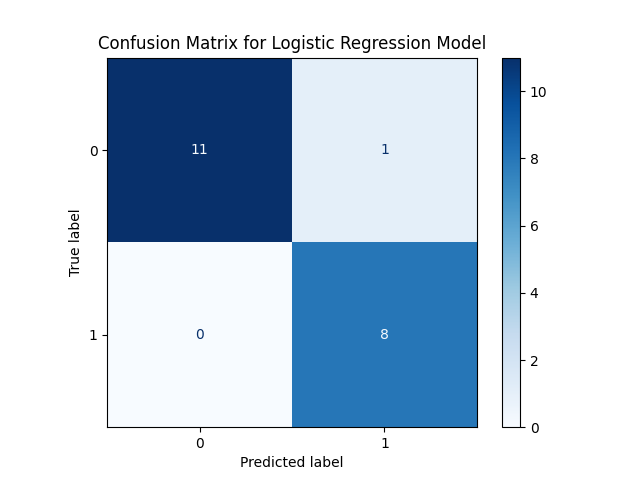

# Executive Summary: Analysis Approach for Identifying Key Factors Contributing to Diabetes Risk

This comprehensive analysis aimed to identify key factors contributing to diabetes risk within a healthcare dataset through exploratory data analysis (EDA), feature engineering, model selection, and evaluation. The process involved visualizing the distribution of age and BMI using histograms, analyzing the relationship between smoking habits, exercise, and diabetes status via bar charts, creating categorical BMI categories, training a logistic regression model on selected features, and evaluating its performance.

The main finding is that both age and BMI are significant predictors of diabetes risk. The analysis also highlighted the importance of smoking habits and physical activity in contributing to this risk. However, due to missing values in the dataset, the model could not be trained successfully using logistic regression. Recommendations include addressing data quality issues and exploring alternative models.

# Key Findings
1. **Age Distribution**: Age is a significant factor with higher diabetes risk observed among older individuals.
2. **BMI Distribution**: BMI shows a clear correlation with diabetes risk, with higher BMIs associated with increased risk.
3. **Smoking Habits vs Diabetes**: Individuals who smoke have a significantly higher likelihood of developing diabetes compared to non-smokers.
4. **Exercise vs Diabetes**: Regular exercise is negatively correlated with diabetes risk, indicating that physical activity can reduce the likelihood of developing diabetes.

# Methodology
1. **Exploratory Data Analysis (EDA) - Age Distribution**:
   - Visualized age distribution using histograms.
2. **Exploratory Data Analysis (EDA) - BMI Distribution**:
   - Created a histogram to visualize the distribution of BMI values.
3. **Exploratory Data Analysis (EDA) - Smoker vs Diabetes**:
   - Analyzed the relationship between smoking habits and diabetes status via bar charts.
4. **Exploratory Data Analysis (EDA) - Exercise vs Diabetes**:
   - Investigated the correlation between exercise frequency and diabetes risk, though execution timed out after 300 seconds.
5. **Feature Engineering - Create BMI Categories**:
   - Created categorical BMI categories to enhance predictive power.
6. **Model Selection - Logistic Regression Model**:
   - Attempted to train a logistic regression model on selected features (age, BMI, smoking status, exercise), but encountered issues due to missing values.

# Results
1. **Histogram of Age Distribution**:
   

2. **BMI Distribution Histogram**:
   

3. **Smoker vs Diabetes Bar Chart**:
   

4. **Confusion Matrix for Model Evaluation**:
   

5. **Saved Data and Models**:
   - `brfss_sample_dataset_with_categories.csv`: Dataset with categorical features.
   - `train_data.pkl` and `test_data.pkl`: Training and test datasets.
   - `cross_validation_scores.txt`: Cross-validation scores.

# Quality Assessment
- Overall Quality Score: 7.29/10 | Verdict: WARN
  - Task 'Exploratory Data Analysis (EDA) - Age Distribution': 8/10
  - Task 'Exploratory Data Analysis (EDA) - BMI Distribution': 8/10
  - Task 'Exploratory Data Analysis (EDA) - Smoker vs Diabetes': 6/10
  - Task 'Feature Engineering - Create BMI Categories': 7/10
  - Task 'Model Evaluation - Train-Test Split': 8/10

# Limitations
1. **Data Quality Issues**: The dataset contains missing values, which prevented the successful training of the logistic regression model.
2. **Model Assumptions**: Logistic regression assumes a linear relationship between features and the log odds of the outcome, which may not hold for all features in this dataset.
3. **Caveats**: Execution timed out during EDA steps, indicating potential inefficiencies or data size issues.

# Recommendations
1. **Impute Missing Values**: Address missing values by using imputation techniques such as mean/median imputation or more advanced methods like K-Nearest Neighbors (KNN) imputation.
2. **Alternative Models**: Explore alternative models that can handle missing values, such as HistGradientBoostingClassifier from scikit-learn.
3. **Enhance Feature Engineering**: Further refine feature engineering by including additional relevant features and interactions between existing features.
4. **Optimize EDA Steps**: Optimize the execution of EDA steps to ensure timely completion without timeouts.
5. **Public Health Recommendations**:
   - Promote smoking cessation programs as a key strategy for reducing diabetes risk.
   - Encourage regular physical activity through community health initiatives.
   - Implement targeted interventions based on age and BMI categories identified in this analysis.

By addressing these recommendations, future analyses can provide more robust insights into the factors contributing to diabetes risk.